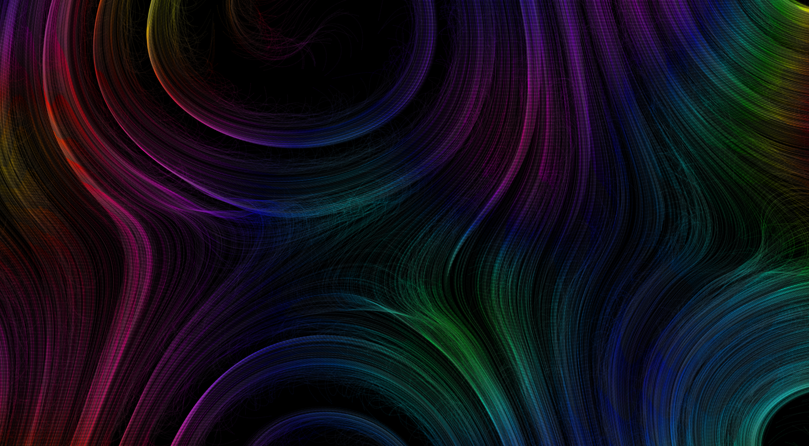
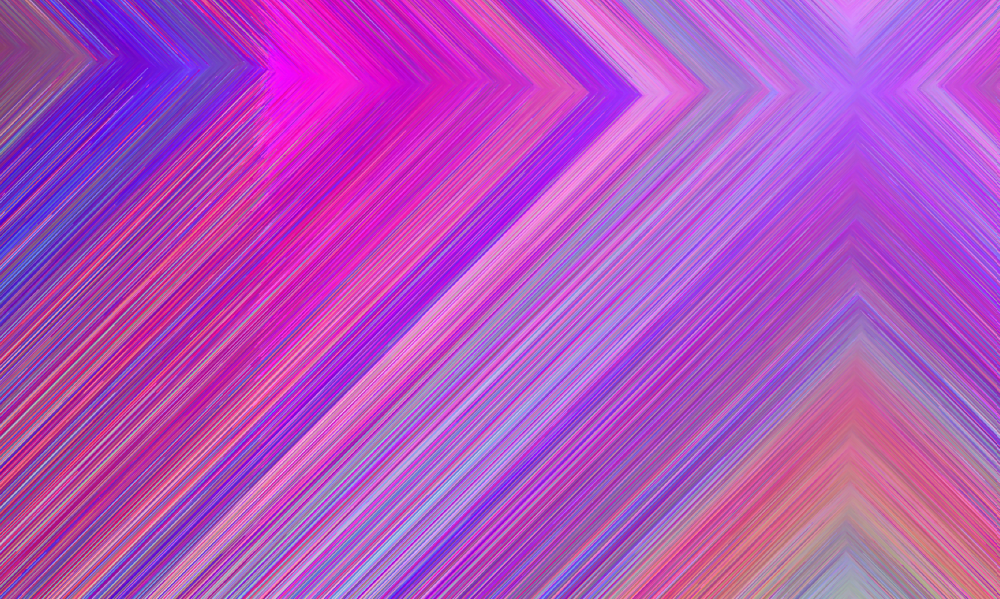
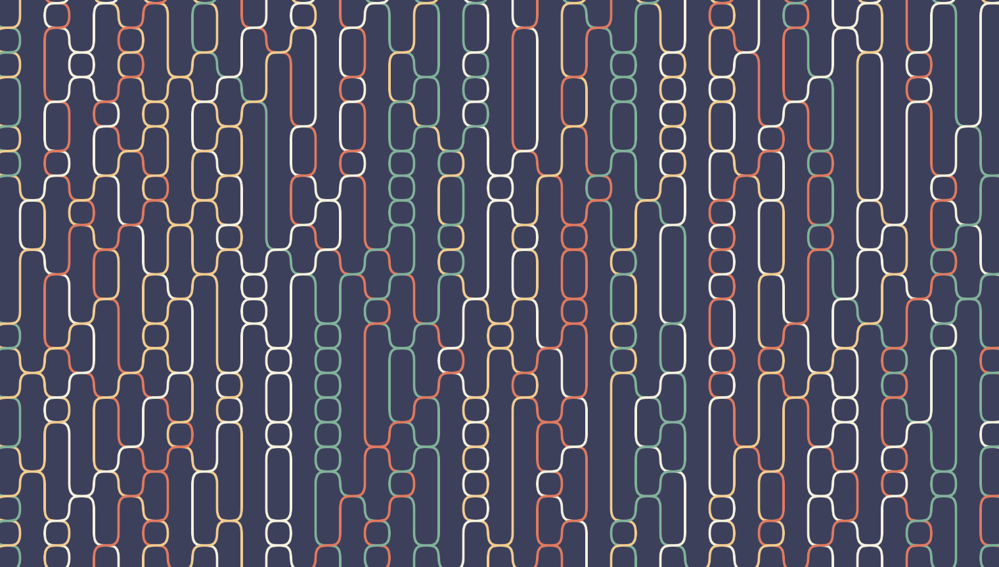

# Generative-Art

>Generative art refers to art that in whole or in part has been created with the use of an autonomous system.

Generative art is all about giving your computer a simple set of instructions and it producing an elaborate and mesmerising piece of art. Here are a few of my experiments to create generative art with the help of p5js. All of these have been coded by me , although I did took some inspiration from other artists. 

Each piece is unique and most are animated, so do visit [Generative-Art](https://divyanshmittal-exe.github.io/Generative-Art/) to generate some more.

If you too, want to experiment with it, [r/generative]( https://www.reddit.com/r/generative/) is a great place to start and get inspired from. 

